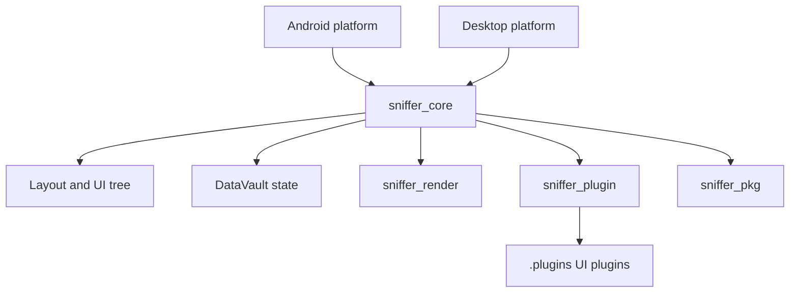

# SnifferLauncher

> A fast, native Android launcher built entirely in Rust, with a plugin-driven UI and an experimental desktop simulator.

[](https://github.com/GreenKod/snifferlauncher/actions/workflows/check.yml)
[](https://www.rust-lang.org/)
[](#requirements)
[](LICENSE)

SnifferLauncher gives you a launcher runtime you can inspect, extend, and iterate on without a JVM or a full Android build stack. The Android app and desktop simulator share the same Rust engine, so UI and plugin work can be tested quickly before deploying to a device.

**No Java. No Kotlin. No Gradle. Just Rust, native Android APIs, and a plugin-oriented UI runtime.**

## Project Status

SnifferLauncher is under active development and is not yet a production-ready launcher. The Android target is the primary experience; the desktop mode is experimental and exists to make UI development and platform work faster. APIs, plugin formats, and visual behavior may change between releases.

## Why SnifferLauncher?

- **Native from the start:** Android integration is implemented in Rust through `NativeActivity`; this repository contains no Java or Kotlin source.
- **Build once, iterate faster:** Use the desktop simulator to work on launcher UI without repeatedly starting an emulator.
- **Extend the launcher:** Home UI, dock elements, widgets, and diagnostics are organized as plugins instead of being locked into one monolithic screen.
- **Share the engine:** Android and desktop use the same layout, state, rendering, and plugin-hosting crates.
- **Keep the system inspectable:** The launcher is a Cargo workspace with focused crates, local plugins, tests, and reproducible development checks.

## Why I Built It

I started SnifferLauncher with a simple question: **Can a complete Android launcher be built without Java or Kotlin, using only Rust and native Android APIs?**

This project is my attempt to find the answer in practice. The goal is not only to make a launcher, but also to explore how far a Rust-first Android application can go when rendering, lifecycle integration, UI composition, and extensibility are designed around one native codebase.

## Technical Highlights

- **Native Android integration:** `NativeActivity`, Rust NDK tooling, and `cargo-apk`, with no Gradle project.
- **Rendering:** OpenGL-based rendering with batching, texture handling, and shared desktop/Android code.
- **Plugin runtime:** JavaScript plugins hosted by QuickJS with manifest-based permissions and runtime limits.
- **UI engine:** Shared layout, styling, UI tree, and reactive state crates.
- **Diagnostics:** Optional `devkit` feature for runtime and rendering metrics.

## Architecture



### Workspace crates

| Crate | Responsibility |
| --- | --- |
| [`sniffer_core`](crates/sniffer_core) | Shared UI tree, layout, styling, and reactive state. |
| [`sniffer_render`](crates/sniffer_render) | OpenGL-based rendering, text resources, batching, and textures. |
| [`sniffer_plugin`](crates/sniffer_plugin) | JavaScript plugin runtime, permissions, limits, and logging. |
| [`sniffer_pkg`](crates/sniffer_pkg) | Dynamic Rust package loading and dependency resolution. |
| [`sniffer_platform_android`](crates/sniffer_platform_android) | Android lifecycle, input, JNI, and wallpaper integration. |
| [`sniffer_platform_desktop`](crates/sniffer_platform_desktop) | Desktop windowing and platform service mocks. |
| [`perf_monitor`](packages/perf_monitor) | Performance monitoring package. |
| [`scroll_view`](packages/scroll_view) | Scrollable UI package. |

Plugins are loaded from [`.plugins`](.plugins). The repository currently includes the default UI, dock, clock widget, DevKit HUD, logger, and the shared [plugin framework](.plugins/framework).

## Requirements

### Desktop

- Rust stable with Rust 2024 edition support.
- A working OpenGL development environment.
- On Linux, the desktop build may require X11/Wayland, GTK, and audio development packages.

The desktop mode is experimental. It is intended for UI iteration and platform development; Android remains the primary target.

### Android

- Android SDK and NDK. The project targets API level 35 and requires a minimum API level of 30.
- `cargo-apk`:

  ```bash
  cargo install --locked cargo-apk
  ```

- An ARM64 Android device or an x86_64 emulator.

## Quick Start

Clone the repository and enter the project directory:

```bash
git clone https://github.com/GreenKod/snifferlauncher.git
cd snifferlauncher
```

### Desktop simulator (experimental)

Run the simulator with the default feature set:

```bash
cargo run --bin snifferlauncher-desktop
```

Enable the optional diagnostics HUD with the `devkit` feature:

```bash
cargo run --bin snifferlauncher-desktop --features devkit
```

For a release build:

```bash
cargo run --bin snifferlauncher-desktop --release
```

Platform helper scripts are available in [`scripts`](scripts), including `run_desktop.ps1` for PowerShell and `run_desktop.sh` for Unix-like shells.

### Android

With a connected device and USB debugging enabled:

```bash
cargo apk run --target aarch64-linux-android --lib --release
```

For an x86_64 emulator:

```bash
cargo apk run --target x86_64-linux-android --lib --release --features devkit
```

The Android package configuration lives in [`Cargo.toml`](Cargo.toml), [`android/AndroidManifest.xml`](android/AndroidManifest.xml), and [`android/res`](android/res).

To inspect launcher logs:

```bash
adb logcat -c
adb logcat -s SnifferLauncher
```

## Plugin Development

Plugins live in `.plugins/<plugin_name>/` and typically contain a `manifest.json` and an entry JavaScript file. The shared DSL and type declarations are in [`.plugins/framework`](.plugins/framework).

Example manifest:

```json
{
  "id": "my_widget",
  "name": "My Custom Widget",
  "version": "1.0.0",
  "entry": "main.js",
  "permissions": ["ui.render", "datavault.read"]
}
```

Example UI plugin:

```javascript
registerApi("my_widget.getUI", function () {
    return CardWidget({
        id: "custom-card",
        title: "Hello from a plugin",
        subtitle: "Rust host, JavaScript UI",
        content: [
            Label("status", "SnifferLauncher", {
                text_color: Theme.colors.accent,
                text_size: vmin(4.0)
            }),
            Button("launch", "Launch App", {
                on_click: () => {
                    broadcastEvent("app.launch", {
                        package: "com.example.app"
                    });
                }
            })
        ]
    });
});
```

Keep plugin permissions as narrow as possible. The manifest declares requested permissions; the host decides which permissions are granted at runtime.

## Development Checks

Run the same core checks used by the project CI:

```bash
cargo fmt --all --check
cargo check --locked --workspace
cargo clippy --locked --workspace --all-targets -- -D warnings
cargo test --locked --workspace --all-features
```

Useful focused commands:

```bash
cargo test --locked -p sniffer_plugin --test manifest_validation_tests
cargo build --locked --release --workspace
```

The complete CI workflow is in [`.github/workflows/check.yml`](.github/workflows/check.yml). It also runs cargo-deny, typo checks, dependency checks, and platform-specific build verification.

## Repository Layout

```text
crates/       Shared Rust engine and platform crates
packages/     Optional Rust packages
.plugins/     Launcher plugins and JavaScript framework
android/      Android resources and manifest
scripts/      Desktop, Android, and quality-of-life scripts
src/          Top-level library and desktop binary
```

## License

SnifferLauncher is distributed under the [Apache License 2.0](LICENSE).
